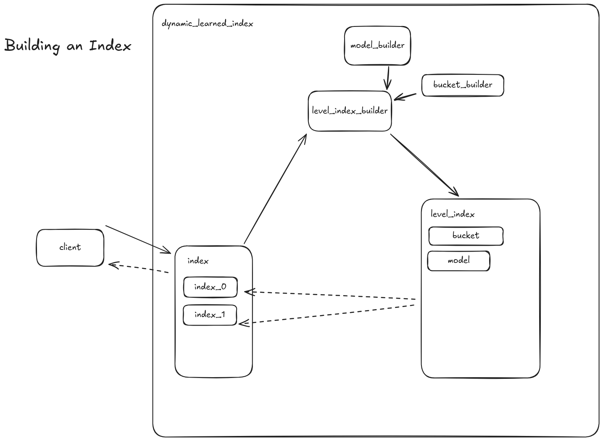

# Dynamic Learned Index implementation in Rust



## Dev

You can find some useful commands in vscode tasks.

The whole project is written in Rust and uses `cargo` as a build system. The project is divided into several crates:
- `dynamic_learned_index`: main library crate that implements the dynamic learned index
- `cli_dynamic_learned_index`: CLI crate that provides a command line interface to run experiments and build the index
- `py_dynamic_learned_index`: Python crate that provides a Python interface to the dynamic learned index

### Run

```shell
cargo run -p cli_dynamic_learned_index
```

## Build

Thi library uses SIMD instructions for performance. It needs to know at a compile time the number of bits in SIMD register that CPU supports. To specify the number of bits go to [`dynamic_learned_index/src/constants.rs`](dynamic_learned_index/src/constants.rs) and change `SIMD_REGISTER_SIZE` constant (do not change any other constants). To find out how many bits in SIMD register your CPU support visit manufacturer webpage (in Linux you can find your CPU model via command `cat /proc/cpuinfo | grep -i 'model name'`). 


Crate depends on `tch-rs` dependency that serves as a wrapper for `libtorch` c++ implementation. 
Follow the installation instructions for `libtorch` from [tch-rs homepage](https://github.com/LaurentMazare/tch-rs).

When using libtorch from pip installation, you need to call cargo build within the environment where the torch package is installed.

```shell
# build is stored in `./target/release`
# entrypoint is in `./target/release/cli_dynamic_learned_index` binary
cargo build --release
```

### Linking with Python

To link the Rust library with Python, we use `maturin` to build a Python package. This allows us to use the Rust code as a Python module.

Setup python environment

```shell
python -m venv env
source env/bin/activate
pip install -r requirements.txt
cd py_dynamic_learned_index
maturin develop
python -c "import py_dynamic_learned_index; print(py_dynamic_learned_index.__version__)"  # test installation
```

Update dynamic_learned_index dependency

```shell
cd py_dynamic_learned_index
maturin develop
python -c "import py_dynamic_learned_index; print(py_dynamic_learned_index.__version__)"  # test installation
```


## Running experiments via CLI

### Dataset

```yaml
dataset:
  type: <type>
  value:
    path: <path>
    dataset_name: <dataset_name>
queries:
  type: <type>
  value:
    path: <path>
    dataset_name: <dataset_name>
ground_truth:
  type: <type>
  value:
    path: <path>
    dataset_name: <dataset_name>
```

`<dataset_name>`: name of the underlining dataset under h5

`<type>`: type of the dataset, can be `h5`

`<path>`: path to the dataset file relative from dataset config directory.

Default values can be found via `cli_dynamic_learned_index defaults dataset` command.

### Index

Example config:

```yaml
levelling: bentley_saxe
levels:
  0:
    model:
      layers:
      - type: linear
        value: 256
      - type: relu
      - type: linear
        value: 256
      - type: relu
      train_params:
        threshold_samples: 1000
        batch_size: 8
        epochs: 3
        label_method:
          type: knn
          value:
            max_iters: 10
    bucket_size: 5000
  5:
    ...
buffer_size: 5000
input_shape: 768
arity: 3
device: cpu
```

`levelling`: levelling strategy, can be `bentley_saxe`

`levels`: levels of the index, specification for each level are taken from the previous level until the level index matches the level in the config. The first level is always 0.

`layers`: layers of the model, can be `linear`, `relu`

`train_params`: training parameters for the model

Default values can be found via `cli_dynamic_learned_index defaults dataset` command.

### Running experiments

To run experiments via CLI, you can use the `cli_dynamic_learned_index` binary. Example:

```shell
./target/release/cli_dynamic_learned_index experiment test_build data/k300 --force
```


## Python API

This is just a design proposal, not implemented yet.

```python
import torch
from py_dynamic_learned_index import DynamicLearnedIndex

index = DynamicLearnedIndex(
    levelling="bentley_saxe",
    levels={
        0: {
            "model": {
                "layers": [
                    {"type": "linear", "value": 256},
                    {"type": "relu"},
                    {"type": "linear", "value": 256},
                    {"type": "relu"}
                ],
                "train_params": {
                    "threshold_samples": 1000,
                    "batch_size": 8,
                    "epochs": 3,
                    "label_method": {"type": "knn", "value": {"max_iters": 0}}
                }
            },
            "bucket_size": 5000
        },
    },
    buffer_size=5000,
    input_shape=768,
    arity=3,
    device="cpu"
)
# Example query tensor
query = torch.zeros(768)
# Insert a query with a label
index.insert(query, label=42)
# Perform a search
results = index.search(query, k=10)
```

## Docker

To run the project in a Docker container.

```shell
docker build -t dli-cli --exclude py_dynamic_learned_index .
docker run -it --rm -v ${PWD}/experiments_data:/app/experiments_data -v ${PWD}/data:/app/data -v ${PWD}/configs:/app/configs dli-cli
```